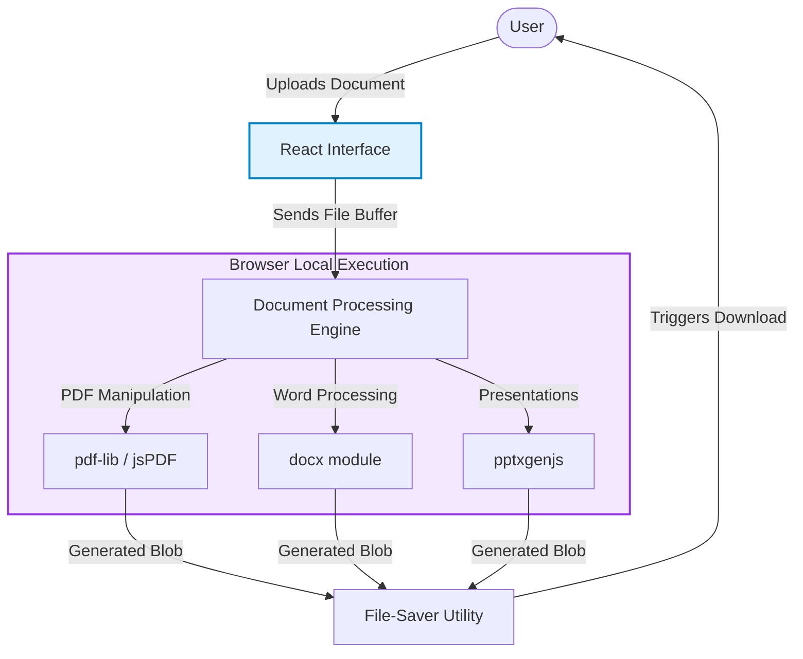

# 📄 PDF Boss
A powerful, browser-based document management suite engineered to handle PDF and DOCX processing on the client-side without compromising data security.

## 📝 Overview
PDF Boss acts as an elite digital toolkit. Capable of parsing, creating, and compiling complex formats, it protects user privacy by executing all document rendering within the browser wrapper. It utilizes high-end document parsing algorithms to manipulate `.pdf` files, `.docx` configurations, and even PowerPoint conversions.

## ✨ Key Features
- **Raw Document Processing**: Integrates `pdf-lib` and `jspdf` to create, split, or merge heavy visual layouts.
- **Multiple Formats**: Uses `docx` and `pptxgenjs` to handle advanced file management arrays without spinning up dedicated APIs.
- **Instant Client Downloading**: Employs `file-saver` functionality for immediate output generation and delivery.
- **Sleek React Framework**: The heavy processing is contrasted by a buttery-smooth frontend utilizing `React 19` and interactive `framer-motion` styling.

## 🛠 Tech Stack
- Framework: `React 19` + `Vite`
- Core PDF Libraries: `pdf-lib`, `jspdf`, `docx`, `pptxgenjs`
- Design/Utility: `Tailwind CSS 4`, `Framer Motion`

## 🏗 System Architecture

PDF Boss is designed as a **client-side only** document processing engine. By keeping all operations within the browser, it ensures zero data transmission, guaranteeing absolute privacy for sensitive documents.



## 📂 File Structure

```text
pdf-boss/
├── public/            # Static assets and favicons
├── src/
│   ├── components/    # Reusable UI components (Modals, Dropzones)
│   ├── pages/         # Core application views (Merge, Split, Convert)
│   ├── utils/         # Document manipulation logic and helpers
│   ├── App.jsx        # Main routing and layout wrapper
│   └── main.jsx       # React application entry point
├── package.json       # Project dependencies and scripts
├── tailwind.config.js # Styling configurations
└── vite.config.js     # Build tool configuration
```

## 🚀 Getting Started

```bash
# Clone and enter the suite
cd pdf-boss

# Build out the massive rendering packages
npm install

# Start manipulating documents instantly
npm run dev
```


## 🌐 Deployment

### Vercel / Netlify (Recommended)
1. Push this repository to GitHub.
2. Connect your GitHub account to [Vercel](https://vercel.com) or [Netlify](https://www.netlify.com).
3. Select this project and use the following settings:
   - **Build Command:** `npm run build`
   - **Output Directory:** `dist`

### GitHub Pages
1. Install the gh-pages package: `npm install gh-pages --save-dev`
2. Add deployment scripts to your `package.json`.
3. Run `npm run deploy`.

## 👨‍💻 Developer
**Kartik Shete**

<!-- Doc sync 3 -->
<!-- Doc sync 15 -->
<!-- Doc sync 19 -->
<!-- Doc sync 23 -->